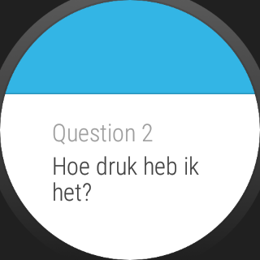
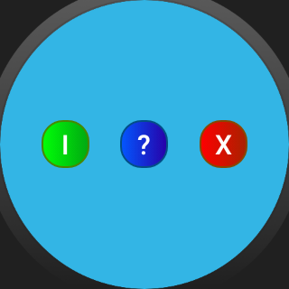
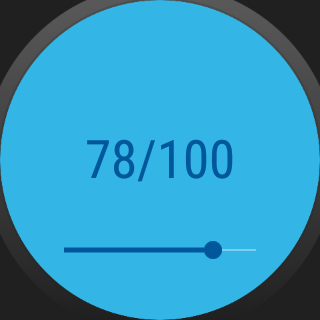

QApp - Questionnaire Application
===================================

Smartwatch and handheld application for providing psychiatric patients with EMAs.

Pre-requisites
--------------

- Android SDK v23
- Android Build Tools v23.0.2
- Android Support Repository

Screenshots
-------------

Getting Started
---------------

This sample uses the Gradle build system. To build this project, use the
"gradlew build" command or use "Import Project" in Android Studio.
